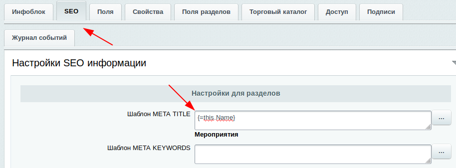

[главная](../../readme.md)

# Общая информация по СЕО

## Настройка СЕО элемента информационного блока:



### Настройки СЕО доступны для:

- Информационного блока
- Раздела информационного блока
- Элемента информационного блока

### Пример простейшего СЕО-шаблона

```text
{=this.Name}
```

### Список зарезервированных слов:

- `this` - означает текущий объект;
- `parent` - родительский объект. Пример: {=parent.PreviewText} - анонсовый текст родительского раздела;
- `sections` - родительские секции начиная с верхнего уровня. пример: {=this.sections.name} - названия родительских разделов;
- `iblock` - инфоблок текущего объекта. Пример: {=iblock.PreviewText} - описание инфоблока;
- `property` - свойство текущего объекта. Пример: {=this.property.CML_ARTICLE} - выведет значение свойства с артикулом. Для того чтобы у элемента показать пользовательское свойство, заданное для раздела, можно воспользоваться шаблоном: {=this.parent.property.name} - выдаст значение свойства UF_NAME;
- Для редакций, имеющих модуль Торговый каталог, можно также получить свойство торгового предложения: {=this.catalog.sku.property.COLOR} - выдаст значение свойства "Цвет" торгового предложения. Чтобы получить значения данного свойства у торговых предложений, но без повторяющихся значений, можно воспользоваться функцией: {=distinct this.catalog.sku.property.COLOR};
- Чтобы получить цены торговых предложений, необходимо указать тип цены, которая должна быть выведена:{=this.catalog.sku.price.BASE;} - выдаст все цены, либо так: {=min this.catalog.sku.price.BASE} можно получить минимальную цену;
- Для получения габаритов товара, необходимо обратиться к соответствующим данным: {=this.catalog.weight} - вес товара, {=this.catalog.measure} - единица измерения, {=concat catalog.store ", "} - склады, перечисленные через запятую

### Функции СЕО-шаблонов

- `lower` - приведет значение к нижнему регистру. Пример: {=lower this.Name};
- `upper` - приведет значение к верхнему регистру. Пример: {=upper this.Name};
- `limit` - ограничить элементы по разделителю. Пример: {=limit {=this.PreviewText} "." 2} - оставит текст до 2 точки, начиная с начала;
- `concat` - задаётся разделитель и несколько строк объединяются через разделитель. Пример: {=concat this.sections.name " / "} - все названия родительских разделов будут соединены с помощью слэша;
- `min` - находит минимальный элемент. Пример: {=min this.catalog.sku.price.BASE};
- `max` - находит максимальный элемент. Пример: {=max this.catalog.sku.price.BASE};
- `distinct` - оставит только значения без повторения(уникальные).;
- `translit` - транслитерация значения. Пример: {=translit this.Name};

### Пример более сложного СЕО-шаблона

```text
{=upper {=concat {=limit "a-b-c" "-" 2} ","}}
```

#### Выполнение шаблона идёт, начиная с самой вложенной функции наружу.

1) `limit` разобьёт строку по дефису и возьмёт первых два значения. Полученный результат передастся на исполнение функции `concat`. 
2) `concat` получит строку из двух символов "a b" и соединит их с помощью запятой ",". Полученный результат передастся на исполнение функции `upper`. 
3) `upper` получит строку "a,b" и переведёт её в верхний регистр "A,B". Результирующая строка "A,B" вернётся в качестве конечного значения.
