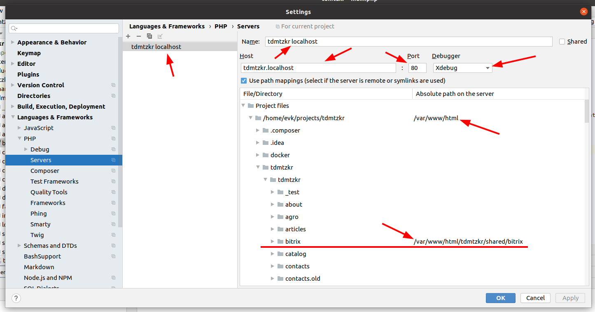
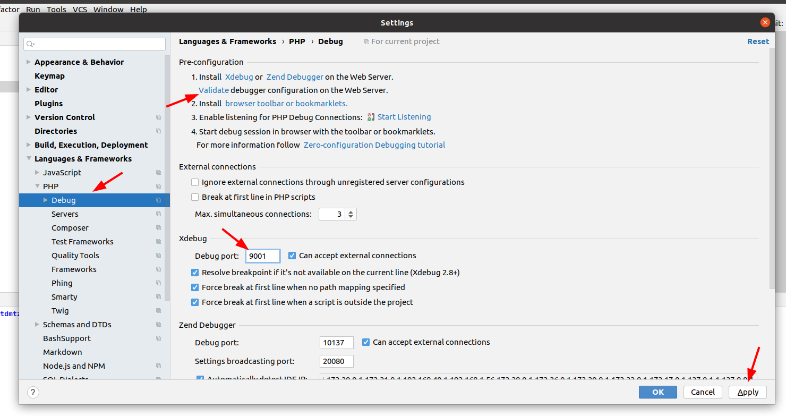

[главная](../../readme.md)

# Настройка xdebug на docker-контейнер

### 1) запускаем окружение

```bash
docker/up.sh
```

### 2) проверяем наличие docker окружения в phpstorm

```text
File | Settings | Build, Execution, Deployment | Docker
```


### 3) переходим в настройки php окружения

```text
File | Settings | Languages & Frameworks | PHP
```

Прописываем DOCUMENT_ROOT для проекта


### 4) добавляем `CLI Interpreter` интерпретатор из докера

Настройка должна происходить на контейнер с php, куда должно быть установлено и настроено расширение xdebug для php.


Нажимаем `Ok`. Проверяем, что `phpstorm` подключился и определил версию `php` и `xdebug`. Нажимаем `Apply` и `Ok` 


### 5) меняем привязку томов для контейнера php


### 6) переходим на закладку настройки серверов

```text
File | Settings | Languages & Frameworks | PHP | Servers
```

Добавляем настройку сервера. Если каталог `bitrix` у вас является симлинком, то необходимо правильно указать расположение реального каталога `bitrix`, чтобы `xdebug` верно определил расположение файлов ядра.



### 7) настраиваем `xdebug`

```text
File | Settings | Languages & Frameworks | PHP | Debug
```


После сохранения всех настроек и нажатии на кнопку `Validate`. Вы увидите результат успешной проверки подключения `xdebug` или сообщения о том, что необходимо изменить.


В данном случае необходимо изменить порт для `xdebug` с `9000` на `9001`. Сообщение о хосте показывается, так как `phpstorm` подозревает, что мы используем не петлевой адрес, хотя в настройках `xdebug` указан петлевой (`localhost`). Это сообщение можно игнорировать, если вы используете адрес, аналогичный `*.localhost `

Меняем порт, сохраняем изменения.



Проверяем настройки


Видим, что ошибок больше нет. Предупреждение о хосте можно игнорировать.

### 8) добавляем раннер для `xdebug`

Через верхнее меню выбираем пункт

```text
Run | Edit configurations...
```


Выбираем созданный ранее сервер для этого проекта. Указываем ключ `PHPSTORM`. Проверяем подключение `xdebug`.


Теперь в меню `Run | Debug` появился новый пункт


### 9) Установка и настройка расширения для браузера

[Browser debugging extensions](https://www.jetbrains.com/help/phpstorm/browser-debugging-extensions.html)

Настраиваем расширение


Запускаем расширение в браузере.


Запускаем xdebug в phpstorm, ставим точку останова и обновляем страницу в браузере.


xdebug готов к работе.
